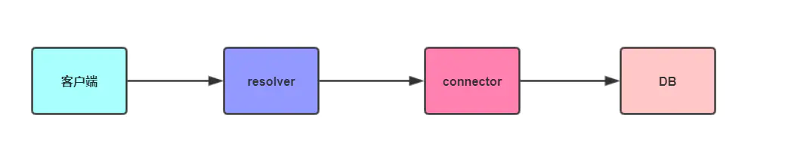

# ts-eggjs-graphql

> 讲真用了好久 eggjs，重来没试过与 ts 结合，这样一个穿来穿去的框架用 ts 怕会变味吧。

## Notes

### 安装插件

- 支持 `TypeScript` 的 `graphql` 插件
  - `npm i --save @switchdog/egg-graphql`
- 开启 CORS 跨域访问
- 关闭 CSRF

### GraphQL 代码结构

`graphql` 目录下，有 `4` 种代码，分别是：`common` 全局类型定义、`query` 查询代码、**mutation 更新操作代码**和 `resolver` 业务实现代码。

```bash
.
├── graphql                       | graphql 代码
│   ├── common                    | 通用类型定义
│   │   ├── resolver.js           | 合并所有全局类型定义
│   │   ├── scalars               | 自定义类型定义
│   │   │   └── date.js           | 日期类型实现
│   │   └── schema.graphql        | schema 定义
│   ├── mutation                  | 所有的更新
│   │   └── schema.graphql        | schema 定义
│   ├── query                     | 所有的查询
│   │   └── schema.graphql        | schema 定义
│   └── user                      | 用户业务
│       ├── connector.js          | 连接数据服务
│       ├── resolver.js           | 类型实现
│       └── schema.graphql        | schema 定义
```

### egg-graphql issues

- 没有 Mutation 时千万别写 `{}`，否则报 `GraphQLError: Syntax Error: Expected Name, found "}"` 这个错误，务必删除多余文件！！

### sequelize mysql

- local-mysql: root/password
- 四个依赖
  - `npm install egg-sequelize --save`
  - `npm install mysql2 --save`
  - `npm install --save-dev sequelize-cli`
  - `npm install --save-dev sequelize-auto`
- 还是使用官方推荐的 `Migrations` 同步表结构，用 `sync:true` 坑点太多
- 利用 `sequelize-auto` 对照数据库自动生成相应的models，使用sequelize-auto对照数据库自动生成相应的models减少了对数据库进行增删改查时的sql语句的编写

```js
const path = require('path');

module.exports = {
  config: path.join(__dirname, 'database/config.json'),
  'migrations-path': path.join(__dirname, 'database/migrations'),
  'seeders-path': path.join(__dirname, 'database/seeders'),
  'models-path': path.join(__dirname, 'app/model'),
};
```

### 流程



### 手机登录

> uuidv1 + redis-setex 倒是没毛病。

```graphql
{
  token: login(data: { phone: "18088260531", password: "123123" })
}
```

```bash
{
  "data": {
    "token": "b9347a00-8de6-11ea-95a8-7320e16f2878"
  }
}
```

### GitHub登录
